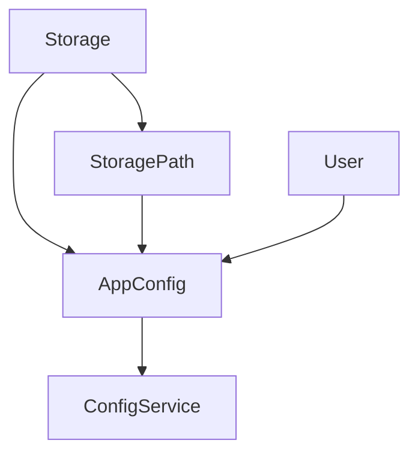

## Software Architecture.

Describing the software structure of the entire app. and the limitation that all design need to adhere to.

### Module Dependency Graph

The relationship between the modules must be a DAG otherwise it becomes difficult to maintain.

