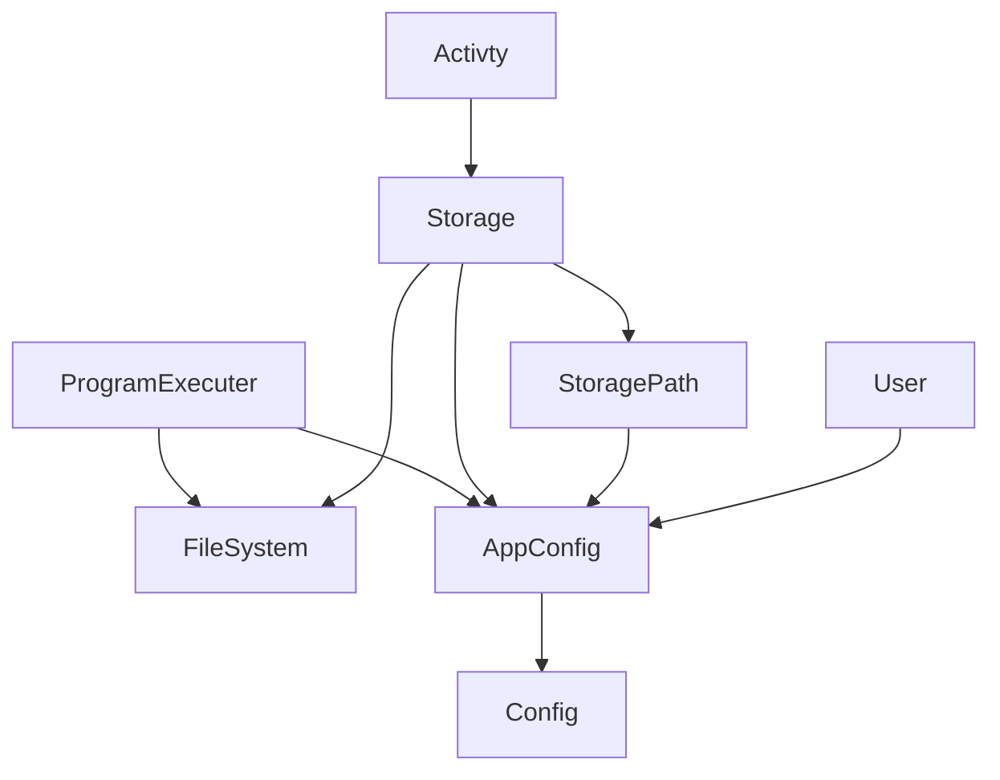

## Software Architecture.

Describing the software structure of the entire app. and the limitation that all design need to adhere to.

### Module Dependency Graph

The relationship between the modules must be a DAG otherwise it becomes difficult to maintain.

### Config Module

ConfigService reads `.env` or enviroment variables for fetching configuration data. It is a nestjs provided module.

### AppConfig Module

AppConfig is responsible for app specific storing configuration which is exported as named beans/provider/service.

### StoragePath Module

StoragePath works StorageEntity. This provides a tree like structures for storing files and folder like objects. It will also help in authorization in the future. If you have access to parent you automatically has access to children.

| id | name | size | mimeType | pathUrl | parentId | storageType | mpath |
| --- | --- | --- | --- | --- | --- | --- | --- |
| 189 | collections |  |  | /collections/ |  | FOLDER | 189. |
| 190 | python-guide |  |  | /collections/python-guide/ | 189 | FOLDER | 189.190. |
| 191 | collection.json | 199 | application/json | /collections/python-guide/collection.json | 190 | FILE | 189.190.191. |
| 192 | activities |  |  | /collections/python-guide/activities/ | 190 | FOLDER | 189.190.192. |
| 193 | introduction |  |  | /collections/python-guide/activities/introduction/ | 192 | FOLDER | 189.190.192.193. |
| 194 | activity.json | 368 | application/json | /collections/python-guide/activities/introduction/activity.json | 193 | FILE | 189.190.192.193.194. |
| 195 | datatypes |  |  | /collections/python-guide/activities/datatypes/ | 192 | FOLDER | 189.190.192.195. |
| 196 | activity.json | 362 | application/json | /collections/python-guide/activities/datatypes/activity.json | 195 | FILE | 189.190.192.195.196. |

The api procided are read only.

### Storage Module.

Storage Modules allows us to create files and folders. It uses StoragePath to create the corresponding `StoragePathEntities`

### Activity Module.

This modules is responsible for creating an activity. The activity is associated with a folder which stores all the related files associated with that activity. Activities are grouped together in the activityCollection.

Once the record is saved the corresponding subscriber will save the data in `activity.json` for backup purposes. This ensures file system contains the total backup of data and can be used to restore the system incase of data loss in db.

### Program Executer Module

This module is responsible for executing the user program (for now python code.) This module will ensure program is run inside a docker container therby restricting execution environment and ensuring malicous code does not cause security issues.
